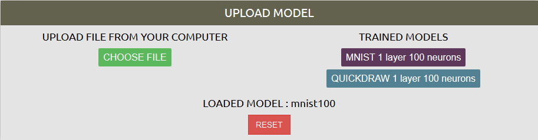
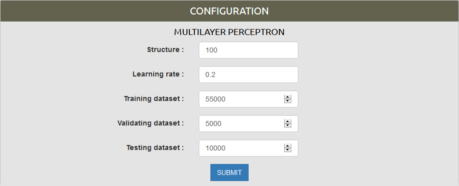
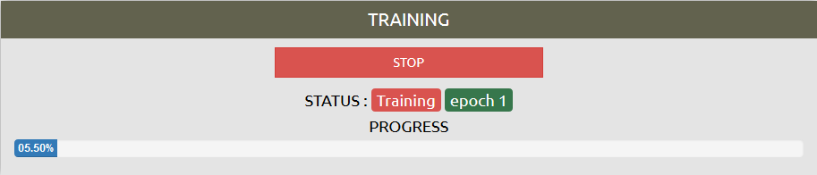
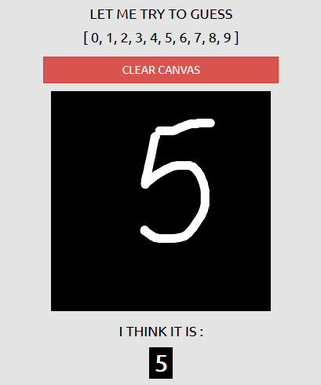

# NNplayground
Link to the project website https://polotent.github.io/NNplayground

## Info
NNplayground is a web platform, where you can train and test your own modification of neural network (multilayer perceptron). 
There are 2 datasets available. MNIST (10 digits) and QUICKDRAW (10 categories).
 
## Getting Started

### Step 1
Choose zone.

### Step 2
If you want to train your own NN, than press "RESET" button.
If you want to try aleady trained models, than press
- "MNIST 1 layer 100 neurons" (MNIST zone)
- "QUICKDRAW 1 layer 100 neurons" (QUICKDRAW zone)
button and go to **Step 5**

### Step 3
Set your parameters. 

#### Structure
If there is only 1 layer, just input number of neurons.

*Structure : 100*

If you want more layers (e.g. 2 layers, first consists of 50, and second of 100), use comma to separate each layer, just like that 

*Structure : 50, 100*

#### Dataset size
You can set our own size for 
- Training (55000 max)
- Testing (5000 max)
- Validating (10000 max)

parts

### Step 4
Train. Notice, that your neural network will be training only while your current browser tab is active.
You can pause, pressing "STOP" button, or just making your current tab inactive.

### Step 5
After the training phase is complete, you can now finally look at the results. Go to guessing window and choose
epoch. You can draw in a black field, and your trained network will try to guess, what is drawn there. 
Something like this:

### Step 6
If you like your network configuration, you can save it locally on your machine, and use later. Just input a name and press "SAVE".

## Used libraries and frameworks
- p5.js
- Bootstrap 3
- Chart.js

## Ideas, used in project
- drawing normalization https://codepen.io/MaciejCaputa/pen/KXbJWR

## Literatue and helpful content
- https://www.amazon.com/Make-Your-Own-Neural-Network/dp/1530826608
- https://www.youtube.com/playlist?list=PLRqwX-V7Uu6Zs14zKVuTuit6jApJgoYZQ

## Datasets 
- MNIST http://yann.lecun.com/exdb/mnist/index.html
- QuickDraw https://github.com/googlecreativelab/quickdraw-dataset
